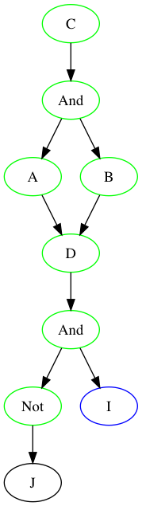

# Expert System

A [backward chaining](https://en.wikipedia.org/wiki/Backward_chaining) [expert system](https://en.wikipedia.org/wiki/Expert_system) with rule visualizer

## Dependencies

* go version 1.13
* github.com/chzyer/readline
* github.com/awalterschulze/gographviz

## Build

```
git clone https://github.com/acarlson99/expert-system.git
cd expert-system
go build
```

Or

```
go get go get github.com/acarlson99/expert-system
go run github.com/acarlson99/expert-system
```

## Run

```
./expert-system						# Enter interactive mode
./expert-system test/test-all.xs	# Evaluate file
./expert-system -f test/test-all.xs	# Enter interactive mode after file evaluated
```

## Syntax

### Operators

| Operator    | Example                 |
| -           | -                       |
| Paren       | `(A + B)`               |
| Not         | `!A`                    |
| And         | `A + B`                 |
| Or          | <code>A &#124; B</code> |
| Xor         | `A ^ B`                 |
| Implication | `A => B`                |

### Commands

| Command                     | Description              |
| -                           | -                        |
| `=AB`                       | Set A and B              |
| `?AB`                       | Query A and B            |
| <code>?=(A &#124; B)</code> | Query expression         |
| `reset A B`                 | Reset variable rules     |
| `list`                      | List variables and rules |
| `quit`                      | Quit program             |
| `help`                      | Display help             |


